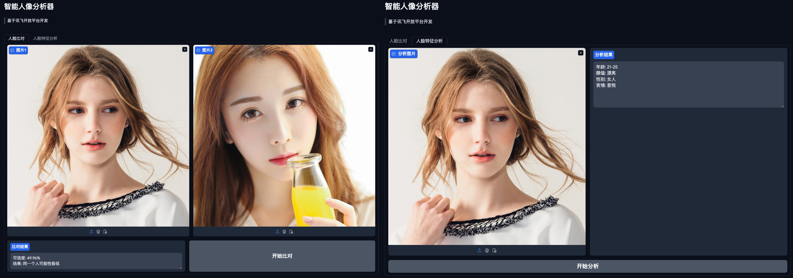

# Portrait explorer

Use gradio to build the interactive interface, and rely on the [iFlytek](https://www.xfyun.cn/) platform API to implement the following functions:
- Face compare
- Face feature analyze



# Deployment

## Installation

It is recommended to use **conda** to create a virtual environment.

```shell
conda create --name portrait-explorer python==3.11
pip install -r requirements.txt
```

Then you need to fill in the api in **example.env** with your own api_key and change the file name to **.env**.

## Run

Use **gradio** to run the program. By default, gradio will start the service on a local port. Just open the URL in the browser.

```shell
gradio app.py
```